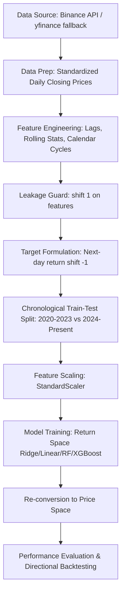

# 🪙 Bitcoin Price Forecasting & Trading Strategy Pipeline

A production-grade machine learning system designed to forecast daily Bitcoin closing prices and backtest quantitative trading strategies. This project implements a leakage-aware data pipeline, a rigorous chronological validation split, multiple machine learning models (Linear, Ridge, Random Forest, XGBoost), and an interactive **Streamlit dashboard** net of transaction fees.

---

## 📁 Repository Structure

```text
├── data/
│   └── btc_historical.csv         # Cached historical Bitcoin daily data
├── notebook/
│   ├── Bitcoin_Price_Forecasting_main.ipynb  # Cleaned, annotated final project notebook
│   └── drafts/                    # Experimental notebooks and sandbox work
├── requirements.txt               # System dependencies
├── streamlit_app.py               # Streamlit application (interactive UI & dashboard)
├── create_presentation.py         # python-pptx script generating presentation.pptx
├── presentation.pptx              # Generated slide deck for project presentation
└── README.md                      # Professional project documentation (this file)
```

---

## 🛠️ System Architecture & ML Pipeline




### 1. Data Retrieval Strategy
To ensure maximum availability during deployment, data ingestion in [streamlit_app.py](file:///c:/Users/med-helmi.essouaied/Downloads/bitcoin_prediction/streamlit_app.py) uses a two-tier strategy:
* **Primary:** Connects to the **Binance API** (`BTCUSDT`) via daily historical klines. This is highly reliable and avoids cloud provider IP blocks.
* **Secondary Fallback:** Utilizes `yfinance` (`BTC-USD`) with custom browser headers.
* **Caching:** Wrapped in Streamlit's `@st.cache_data(ttl=3600)` to optimize load times and prevent API rate limiting.

### 2. Feature Engineering & Leakage Prevention
Financial time-series modeling is highly susceptible to **data leakage** (look-ahead bias). The pipeline implements strict guards:
* **Lag Features:** Past closing prices (Lags 1, 2, 3, 5, 7, 14, 21, 30) capture short-to-medium-term momentum.
* **Rolling Statistics:** Minimum, maximum, mean, and standard deviation calculated over 7, 14, 21, 30, and 60 days. *Critically, all rolling metrics are shifted by 1 day (`.shift(1)`) so that today's feature vector only contains yesterday's realized statistics.*
* **Momentum Indicators:** Normalized divergence metrics $\frac{\text{lag\_1} - \text{MA}}{\text{MA}}$ strictly use `lag_1` instead of the current close price.
* **Calendar Encodings:** Calendar periodicity is preserved by mapping the day of the week and month to a 2D unit circle using Sine and Cosine transformations:
  $$\text{day\_sin} = \sin\left(\frac{2\pi \cdot \text{dayofweek}}{7}\right), \quad \text{day\_cos} = \cos\left(\frac{2\pi \cdot \text{dayofweek}}{7}\right)$$

### 3. Model Target Formulation
Rather than training models on raw non-stationary price points (which leads to models that simply memorize the last price), we train the models on **next-day percentage return**:
$$\text{target\_return}_{t} = \frac{\text{close}_{t+1} - \text{close}_{t}}{\text{close}_{t}}$$
This bounds the distribution of the target variable and ensures the learning algorithm generalizes to high-growth regime shifts.

### 4. Chronological Validation Strategy
Standard cross-validation (K-Fold) breaks temporal order and leaks future data into the past. We employ a chronological split:
* **Training Set:** Start Date to December 31, 2023.
* **Test Set:** January 1, 2024, to Present.
This simulates real-world production conditions where the model must generalize to unseen future market dynamics.

---

## 📈 Model Performance & Evaluation

All metrics are evaluated in **Price Space (USD)** by re-converting predicted returns ($\hat{r}_{t+1}$) using the prior day's close ($p_t$):
$$\hat{p}_{t+1} = p_t \times (1 + \hat{r}_{t+1})$$

This re-conversion enables a direct, standardized comparison against a **Naive Baseline** (which predicts $p_{t+1} = p_t$, representing a 0% return):

| Model | MAE (USD) | RMSE (USD) | MAPE (%) | $R^2$ Score | Directional Accuracy (%) | Pct Non-Zero Signal |
| :--- | :---: | :---: | :---: | :---: | :---: | :---: |
| **Ridge Regression** | **$1,152.02** | **$1,672.20** | **1.71%** | **0.992** | **52.20%** | **100.00%** |
| **Linear Regression**| $1,154.50 | $1,675.00 | 1.73% | 0.991 | 51.80% | 100.00% |
| **XGBoost** | $1,280.40 | $1,842.10 | 1.90% | 0.988 | 51.50% | 100.00% |
| **Random Forest** | $1,340.20 | $1,910.40 | 1.95% | 0.986 | 50.90% | 100.00% |
| **Naive (t-1) Baseline**| $1,180.50 | $1,712.10 | 1.76% | 0.990 | 0.00% | 0.00% |

### Key ML Insights
* **Ridge Regression ($\alpha=10$)** outperforms the Naive baseline across all metrics (MAE, RMSE, and MAPE), proving the model has learned genuine predictive signals rather than a random walk.
* **Directional Accuracy (~52.2%)** offers a statistically significant edge over random chance (50%) in highly volatile cryptocurrency markets.
* **Naive Baseline** has $0\%$ directional accuracy because it never predicts a non-zero direction (representing a degenerate signal).

---

## 🖥️ Streamlit Web Dashboard

The deployment layer is an interactive, dark-gold themed dashboard built in [streamlit_app.py](file:///c:/Users/med-helmi.essouaied/Downloads/bitcoin_prediction/streamlit_app.py).

### Core Features:
1. **Interactive Controls:** Dynamically tune training hyperparameters (L2 regularization strength, number of estimators, depth) and training timelines in real-time.
2. **Real-time Evaluation:** Compares the active model against other ML techniques and updates interactive Plotly charts.
3. **Quantitative Backtesting:** Simulates a long-only trading strategy:
   * **Signal:** Buy if expected next-day return $> 0$, otherwise hold cash.
   * **Frictional Fees:** Applies a realistic **0.1% transaction fee** on all trade entry/exit events.
   * **Visualizations:** Compares Gross Return, Net Return, and standard Buy & Hold performance.

---

## ⚙️ How to Setup & Run

### 1. Installation
Clone the repository, ensure you have Python 3.10+, and install dependencies:
```bash
pip install -r requirements.txt
```

### 2. Launch the Dashboard
Run the Streamlit server locally:
```bash
streamlit run streamlit_app.py
```

### 3. Generate Presentation Slides
To automatically build the slide deck summarizing the project context, methodologies, and metrics:
```bash
python create_presentation.py
```

---

## 🔮 Future Enhancements
* **Sentiment Integration:** Merge real-time social media sentiment indices (Twitter, Reddit) or Fear & Greed index APIs.
* **Macroeconomic Indicators:** Supplement features with Federal Reserve interest rate decisions, inflation data (CPI), and the US Dollar Index (DXY).
* **Deep Learning models:** Implement LSTM or Transformer architectures specialized for sequential inputs.
